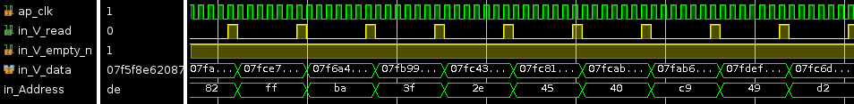
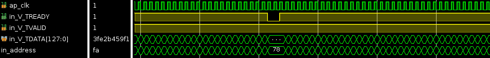

# HLS RAW dependency example
The system takes a reads a memory entry updates according to the chosen operation. Operands type can also be changed.

**Implementations:**
- Baseline: Base system with static optimizations only (bypassing + prefetching)
- Conditional stalling: System using the conditional stalling technique to insert idle cycles only when conflicts are detected
  - Merged: stalling logic implemented within the processing module
  - Stage: stalling logic implemented as a separated stage connected using a dataflow to the processing module

## Performance
Baseline (large II even with no address conflicts):

With conditional stalling (inserts idle cycles only when conflicts are detected):

Merged vs Stage implementations:
|         | $DD=8$ AW=8  | $DD=8$ AW=8  | $DD=16$ AW=16 | $DD=16$ AW=16 |
|:-------:|:------------:|:------------:|:-------------:|:-------------:|
|   Part  |     Stage    |    Merged    |     Stage     |     Merged    |
| Z7020-1 |      200     |      150*    |      165*     |      125*     |
| ZU4EV-2 |      635     |      450*    |      575*     |      395*     |

- DD: Dependency distance = Read Latency + Processing Latency + Write Latency -1
- AW: Address Width
- Frequencies are in MHz and rounded to the closest multiple of 5.
- BRAM were configured in read-first mode.
- '*' means that the conflict detection logic in critical path.

## Build parameters
- make targets: csim | syn | cosim | vivado_synth | impl  | profiling_steps
- PART: zcu104 | pynq_z2
- HLS_PERIOD: frequency target for HLS compiler
- IMPL_PERIOD: frequency target for RTL synth & impl.
- DEP_DIST: Read (1 cycle) + processing Latencies
- OP_CODE: 0 (add) | 1(mul) | 2 (div)
- DATATYPE: 0 (double) | 1(float) | 2 (int32)
- ID_FACTOR: The address size used by the conditional stalling logic is 8*ID_FACTOR bits (memory size is fixed to 2^8 entries to decouple frequency penalties associated with bigger memories)
