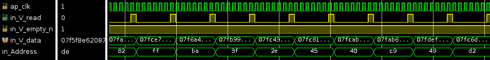
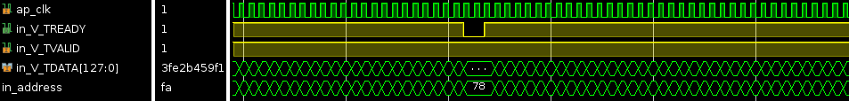
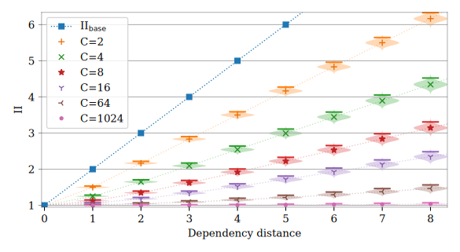
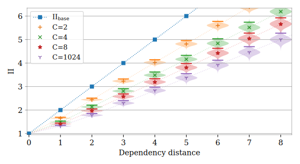
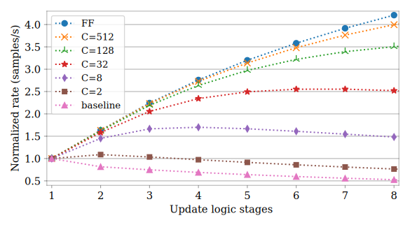

# Enhancing conditional stalling to boost performance of stream-processing logic with RAW dependencies
**Publication:**
- Journal: IEEE TRANSACTIONS ON CIRCUITS AND SYSTEMS—II: EXPRESS BRIEFS
- Title: "Enhancing conditional stalling to boost performance of stream-processing logic with RAW dependencies"
- Authors: Tobías Alonso, Gustavo Sutter, Sergio Lopez-Buedo, and Jorge E. López de Vergara

**Objective of the repository:**
Data dependencies are present in multiple applications, establishing hard to optimize bottlenecks, where pipelining is counterproductive.
Although these dependencies may rarely constitute address conflicts, High-Level Synthesis compilers rely on static analysis, so the scheduling of the logic circuits must assume the worst-case scenario.
Conditional stalling is a simple yet impactful technique, useful even when conflicts are common.
At the cost of a small area penalty, it allows improving (in some cases, by several times) the mean throughput.
This technique requires the addition of logic to detect conflicting memory access and consists in running a pipeline at full rate when no conflicts are detected, while stalling the appropriate stages until those that appear are solved.
The repository contains HLS implementations as well as analysis functions that aim at understanding when to use conditional stalling and how to optimize throughput with it.

## Contents
- HLS: High-Level synthesis example code of a stream processing module. Three implementations are provided: a baseline and two using the condition stalling technique
- notebooks:
  - conditional_stalling.py: small library containing functions to model conditional stalling behavior (simulation and mathematical models)
  - Three notebooks that analyze and tests approximations for uniform, Zipf and random stateless address distributions.

## Reduction of idle cycles in execution
**Baseline implementation:**
- Static optimizations: bypassing and prefetching (possible frequency penalties)
- Large II even with no address conflicts

**With conditional stalling:**
- Inserts idle cycles only when conflicts are detected

The system doesn't use bypassing, although they could be combined, resulting in less idle cycles (with possible frequency penalties)

## Performance comparison for a given pipeline latency

For a given pipeline latency, it allows great throughput improvements..

**Performance for uniformly distributed addresses:**

Mean II for the system. PDFs are plotted as violin plots for blocks of 1000 iterations (99th percentile delimited). C is the number of possible addresses (cardinality).

**Performance for Zipf distributed addresses (Skewed distribution example):**

Mean II for the system for Zipf distributed addresses with **s=1.8** (Very skewed distribution). PDFs are plotted as violin plots for blocks of 1000 iterations (99th percentile delimited). C is the number of possible addresses (cardinality).

## Enables increasing throughput with pipelining
As the address conflict rate decreases, the throughput evolution as a function of the pipeline depth moves away from the baseline implementation (only static optimizations) and gets closer to that of feed-forward logic (FF curve)

